<div align="center">


<h1>DR Testing Automation</h1>

<p><strong>The Enterprise Standard for Industrialized Resilience Validation and Automated DR Drills</strong></p>

[]()
[]()
[]()
[]()

<br/>

> **"A plan is nothing; testing is everything."** 
> DR Testing Automation is a flagship repository designed to enable organizations to design, schedule, and automate disaster recovery validation through industrialized drills and evidence collection.

</div>

---

## 🏛️ Executive Summary

**DR Testing Automation** is a flagship repository designed for Chief Technology Officers (CTOs), SRE Teams, and Resilience Leaders. In a world where infrastructure complexity grows daily, the only way to ensure recovery is to test it continuously.

This platform provides an industrialized approach to **Resilience Validation**, delivering production-ready **Automated DR Drills**, **Failover Simulation**, **Backup Restore Validation**, and **Evidence Generation for Audits**. It supports **Azure**, **AWS**, **GCP**, and **Kubernetes**, enabling organizations to transition from "Hope-Based DR" to "Validated Resilience."

---

## 💡 Why DR Testing Matters

Testing is the ultimate truth-teller in disaster recovery:
- **Ensuring Recoverability**: Proving that systems can actually be restored within RTO/RPO targets.
- **Dependency Discovery**: Identifying hidden application dependencies that break during failover.
- **Ransomware Readiness**: Validating that backup sets are uncorrupted and restorable.
- **Audit & Compliance**: Providing automated evidence of testing to regulatory bodies and stakeholders.

---

## 🚀 Business Outcomes

### 🎯 Strategic Readiness Impact
- **Increased Recovery Confidence**: Moving from periodic manual tests to automated, frequent validation.
- **Reduced Downtime Risk**: Identifying and fixing recovery gaps before a real disaster occurs.
- **Streamlined Audits**: Generating comprehensive drill reports and evidence automatically.
- **Optimized Resilience Spend**: Aligning testing efforts with business criticality tiers.

---

## 🏗️ Technical Stack

| Layer | Technology | Rationale |
|---|---|---|
| **Drill Engine** | Python, Ansible, Terraform | High-performance execution of automated DR drills and restoration workflows. |
| **Control Plane** | FastAPI | High-performance API for request management and testing orchestration. |
| **Frontend** | React 18, Vite | Premium portal for executive dashboards, drill planners, and evidence centers. |
| **IaC Foundation** | Terraform | Multi-cloud infrastructure consistency and testing foundation automation. |
| **Database** | PostgreSQL | Centralized repository for drill history, evidence metadata, and history. |
| **Observability** | Prometheus / Grafana | Real-time monitoring of drill pass rates, recovery durations, and system health. |

---

## 📐 Architecture Storytelling: 70+ Diagrams

### 1. Executive High-Level Architecture
The holistic vision of the enterprise resilience testing journey.

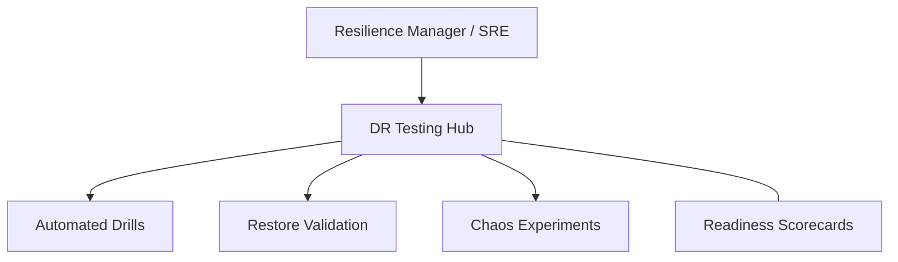

### 2. Detailed Component Topology
The internal service boundaries and management layers of the platform.

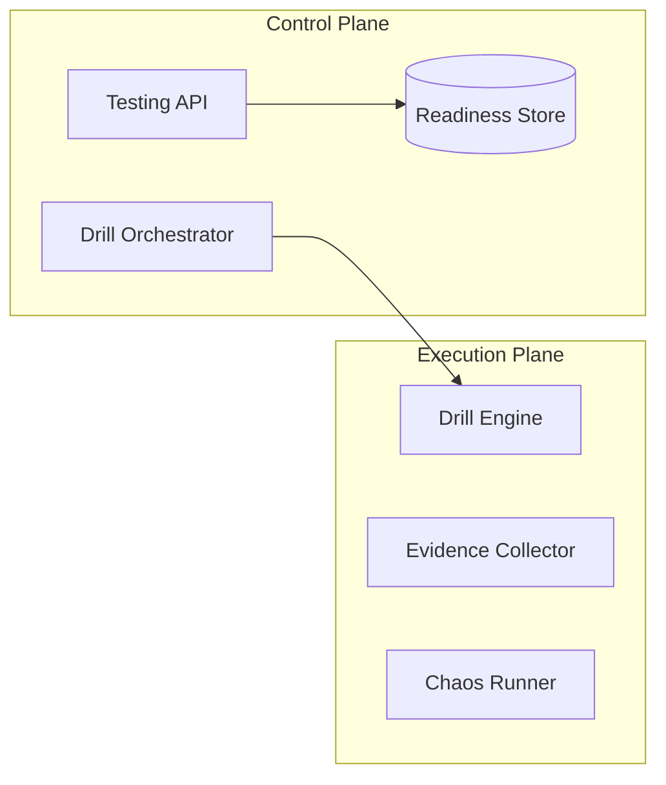

### 3. User to Control Plane Request Path
Tracing a drill execution command through the industrialized testing stack.

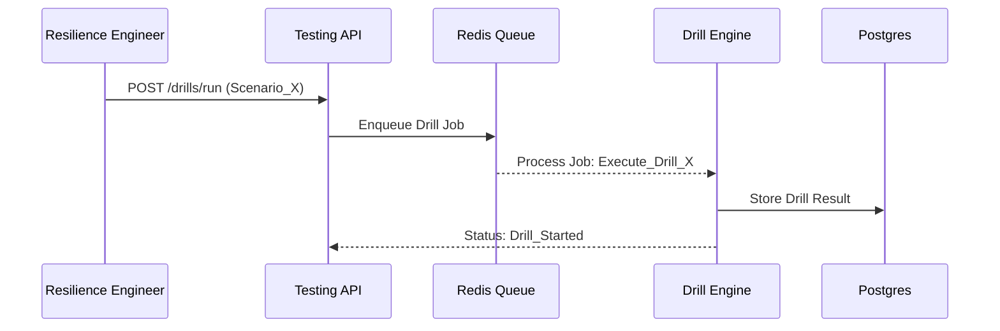

### 4. Testing Orchestration Control Plane
The "Brain" of the framework managing global testing definitions.

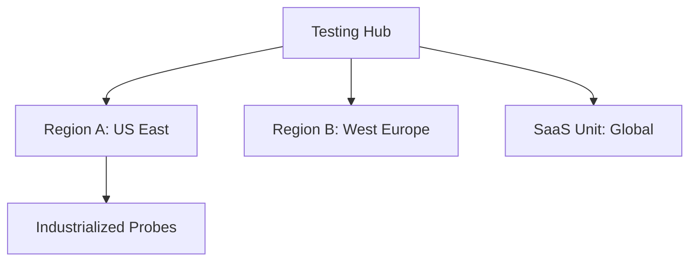

### 5. Multi-Cloud Topology
Synchronizing testing standards across Azure, AWS, and GCP.

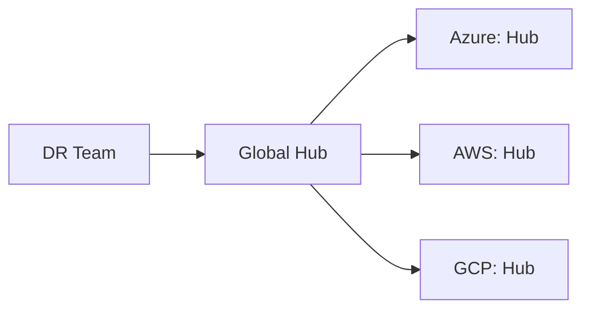

### 6. Regional Deployment Model
Hosting drill workers and evidence collectors close to the targets for accuracy.

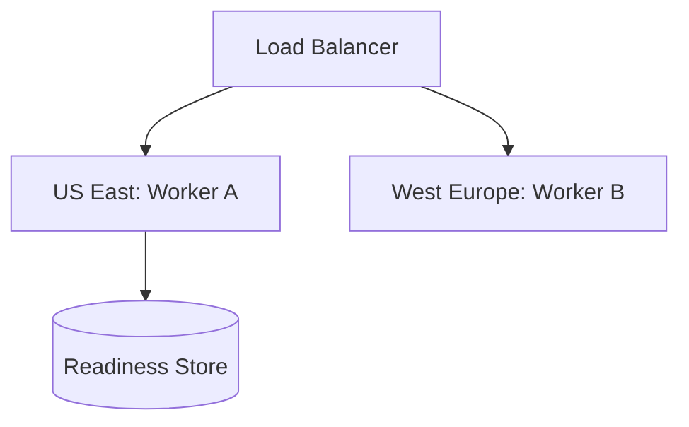

### 7. DR Failover Model
Ensuring platform continuity for the testing hub itself.

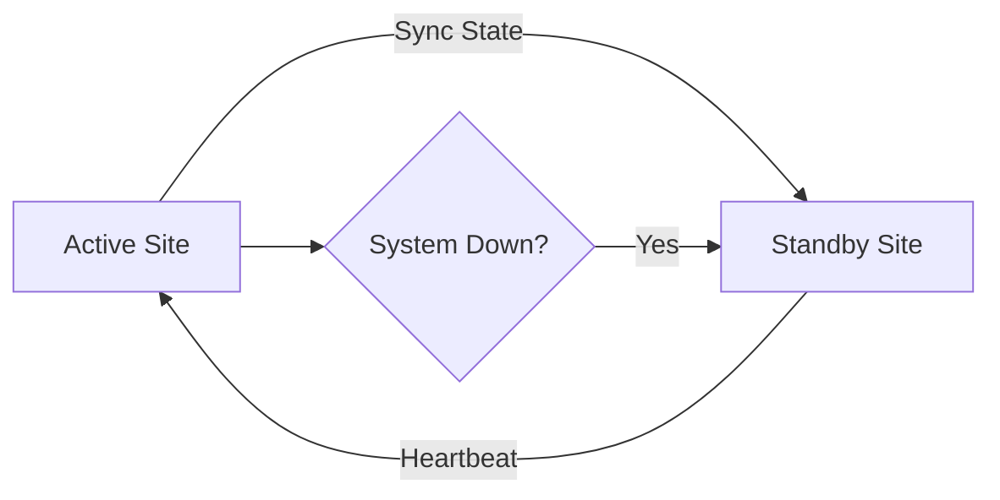

### 8. API Gateway Architecture
Securing and throttling the entry point for testing orchestration.

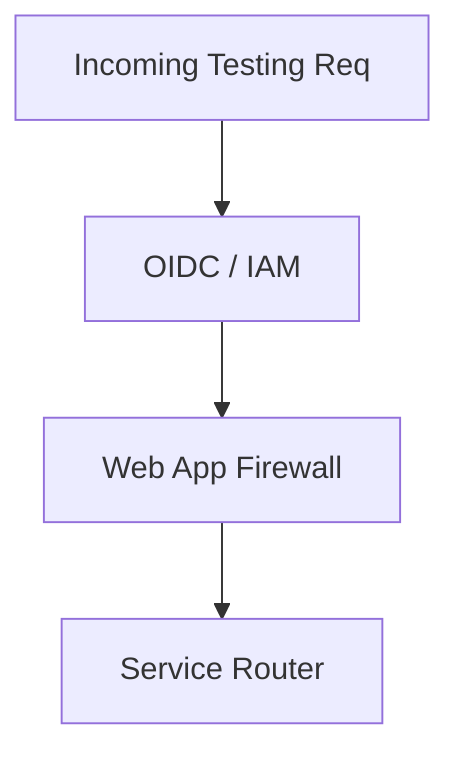

### 9. Queue Worker Architecture
Managing long-running restore and validation tasks at scale.

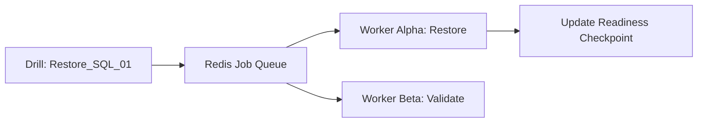

### 10. Dashboard Analytics Flow
How raw drill results become executive readiness scorecards.

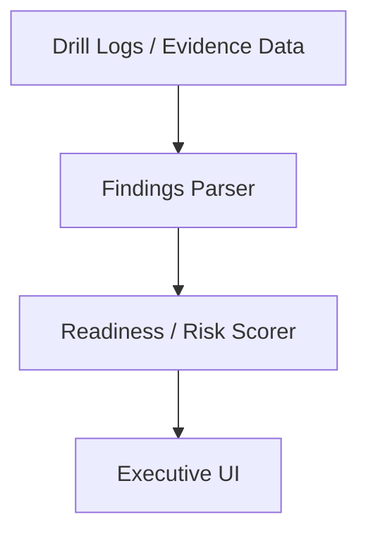

### 11. Scheduled Drill Workflow
Automating the execution of regular, non-disruptive recovery tests on a predefined schedule.


### 12. On-Demand Drill Model
Enabling SRE teams to trigger ad-hoc drills for specific applications or regions.

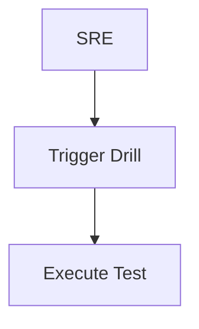

### 13. Application Failover Test Flow
Simulating the shift of application traffic from primary to standby environments.

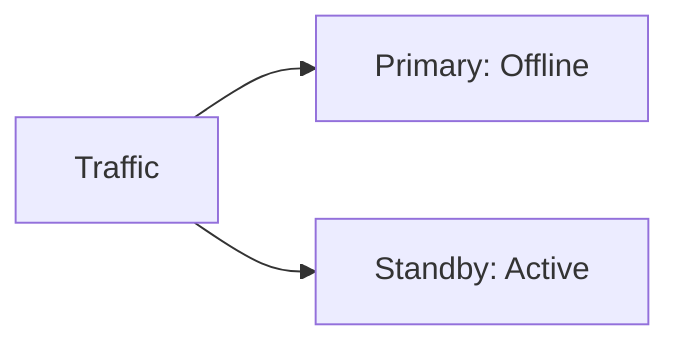

### 14. Database Restore Test Workflow
Validating the ability to recover a database to a clean state from backup sets.

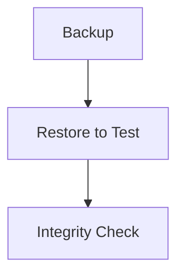

### 15. DNS Cutover Simulation Model
Testing the propagation and effectiveness of DNS record changes during failover.

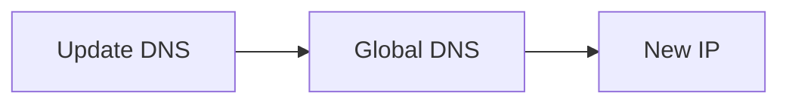

### 16. Load Balancer Switch Test
Validating backend health check behavior and traffic routing during service failure.

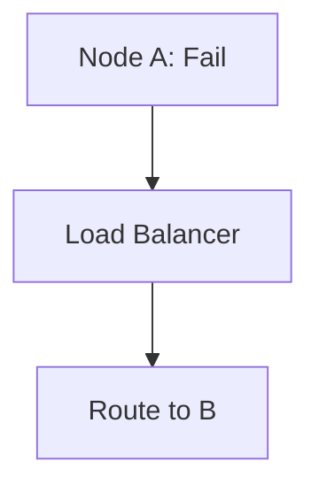

### 17. Warm Standby Activation Test
Testing the scale-up and synchronization of a warm standby environment.


### 18. Active-Active Resilience Test
Verifying the robustness of bi-directional synchronization and load distribution.

```mermaid
graph TD
    SiteA[Active] <->|Bi-Sync| SiteB[Active]
```

### 19. Tabletop Exercise Workflow
Automating the coordination and decision-making flow of manual recovery simulations.

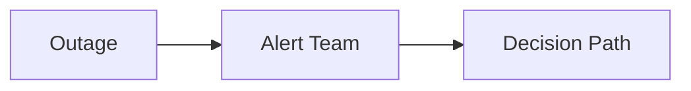

### 20. Communication Bridge Model
Orchestrating crisis communication channels (Slack, Teams, PagerDuty) during a drill.

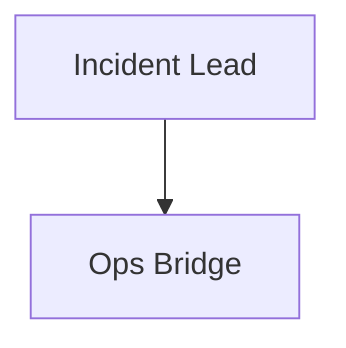

### 21. Snapshot Restore Lifecycle
Validating the speed and reliability of infrastructure recovery from cloud snapshots.

```mermaid
graph LR
    Snap[Snap] --> Disk[Disk] --> VM[VM Mount]
```

### 22. PITR Validation Workflow
Proving point-in-time recovery capabilities down to the millisecond.

```mermaid
graph TD
    Time[T: 10:00:01] --> Restore[Target State]
```

### 23. Immutable Backup Restore Model
Testing recovery from write-once-read-many (WORM) storage vaults.

```mermaid
graph LR
    Vault[WORM] -->|Pull| TestNet[Isolated Net]
```

### 24. Air-Gapped Recovery Test
Simulating restoration from logically or physically isolated backup environments.

```mermaid
graph TD
    Hub[Hub] ---|Isolated| Vault[Air-Gap]
```

### 25. Ransomware Recovery Exercise
Testing the identification and restoration of the "Last Known Good" clean state.

```mermaid
graph LR
    Scan[Malware Scan] --> Clean[Restore Clean]
```

### 26. Cross-Region Backup Copy Test
Verifying the integrity of backup data after inter-regional replication.

```mermaid
graph TD
    East[East US] -->|Copy| West[West US]
```

### 27. Backup Verification Model
Automated scheduled checks to ensure backups are restorable and not empty.

```mermaid
graph LR
    Sched[Sched] --> Verify[Restore Sample]
```

### 28. Restore Data Integrity Flow
Using checksums and validation scripts to prove data consistency post-restore.

```mermaid
graph TD
    Data[Restored] --> Hash[MD5 Check]
```

### 29. Archive Retrieval Test Lifecycle
Testing the SLA and reliability of retrieving aged data from cold storage.

```mermaid
graph LR
    Cold[Glacier/Cold] --> Thaw[Hydrate] --> Check[Ready]
```

### 30. Retention Governance Flow
Validating that data is correctly purged after its compliance lifecycle ends.

```mermaid
graph TD
    Policy[7 Years] --> Purge[Automated Delete]
```

### 31. AKS Recovery Test Model
Testing Kubernetes cluster recovery using Velero or Azure Backup for AKS.

```mermaid
graph LR
    AKS_A[A] --> Backup[Blob] --> AKS_B[B]
```

### 32. EKS Recovery Test Model
Orchestrating cross-account and cross-region EKS cluster recovery tests.

```mermaid
graph TD
    EKS_A[A] --> S3[Storage] --> EKS_B[B]
```

### 33. GKE Recovery Test Model
Validating GKE multi-zonal and regional cluster recovery workflows.

```mermaid
graph LR
    GKE_A[A] --> GCS[Bucket] --> GKE_B[B]
```

### 34. Multi-Cluster Failover Test
Shifting production traffic between geographically dispersed K8s clusters.

```mermaid
graph TD
    Traffic[Traffic] --> ClusterA[A: Down]
    Traffic --> ClusterB[B: Up]
```

### 35. Terraform Rebuild Workflow
Using IaC to reconstruct an entire environment from scratch in a new region.

```mermaid
graph LR
    State[State] --> Apply[Terraform Apply]
```

### 36. Secret Restoration Validation
Verifying that application secrets and API keys are correctly recovered.

```mermaid
graph TD
    KV[Key Vault] -->|Restore| App[App Secrets]
```

### 37. Ingress Recovery Test
Testing the re-establishment of public entry points (ALB/Nginx) in recovery.

```mermaid
graph LR
    IP[New IP] --> DNS[Update Record]
```

### 38. Persistent Volume Migration Test
Validating the movement of stateful data across Kubernetes clusters.

```mermaid
graph TD
    VolA[Vol A] --> Sync[Sync] --> VolB[Vol B]
```

### 39. Namespace Restore Lifecycle
Recovering specific business logic units within a multi-tenant cluster.

```mermaid
graph LR
    NS[Namespace] --> Objects[Deploy/Svcs]
```

### 40. Cluster Bootstrap Drill
Automating the sequence of cluster creation, networking, and add-on deployment.

```mermaid
graph TD
    Net[VPC] --> K8s[Control Plane] --> Nodes[Workers]
```

### 41. Recovery Time Measurement
Calculating the actual RTO achieved during a drill vs. the business target.

```mermaid
graph LR
    Start[Down] --> End[Up] --> Result[Duration]
```

### 42. Dependency Validation Flow
Verifying that all upstream/downstream services are healthy post-failover.

```mermaid
graph TD
    App[App] --> Check[Dep A] & Check2[Dep B]
```

### 43. Metrics Pipeline
Monitoring the performance of the DR testing platform itself.

```mermaid
graph LR
    Hub[Hub] --> Prom[Prometheus]
```

### 44. Logging Architecture
Centralized, tamper-proof logging of all drill actions and outcomes.

```mermaid
graph TD
    Action[Step] --> Log[Loki/Elastic]
```

### 45. Tracing Model
Tracing distributed recovery steps across cloud providers and regions.

```mermaid
graph LR
    Step1[DNS] --> Step2[DB] --> Step3[App]
```

### 46. Alert Routing Workflow
Directing drill failures and RPO/RTO breaches to the right on-call teams.

```mermaid
graph TD
    Fail[Fail] --> Route[PD / Slack]
```

### 47. Capacity Planning Model
Simulating the performance of the recovery site under full production load.

```mermaid
graph LR
    Load[Prod Load] --> Test[Recovery Scale]
```

### 48. Change Freeze Governance
Ensuring that recovery runbooks are locked and validated during high-risk periods.

```mermaid
graph TD
    Freeze[Freeze] --> Lock[Runbook Lock]
```

### 49. Incident Escalation Model
The notification path during a failed drill or a genuine recovery event.

```mermaid
graph LR
    Eng[Eng] --> Mgr[Mgr] --> Exec[Exec]
```

### 50. Evidence Repository Lifecycle
The automated collection and long-term storage of drill evidence for audits.

```mermaid
graph TD
    Result[Pass] --> Evidence[S3/Blob Store]
```

### 51. Executive KPI Review Cycle
The quarterly rhythm of reporting resilience posture to leadership.

```mermaid
graph LR
    Stats[Stats] --> Deck[Board Deck]
```

### 52. RPO Scorecard Workflow
Quantifying data loss risks across the application portfolio.

```mermaid
graph TD
    Target[15m] vs Actual[22m: Risk]
```

### 53. RTO Heatmap Model
Visualizing recovery speed capabilities across business units.

```mermaid
graph LR
    UnitA[A: 1h] --- UnitB[B: 12h]
```

### 54. Criticality Tier Model
Prioritizing testing effort based on business impact (Tier 0 to Tier 3).

```mermaid
graph TD
    Tier0[Mission Crit] --> Tier1[Essential]
```

### 55. Budget Prioritization Workflow
Aligning testing spend with the value of the digital assets protected.

```mermaid
graph LR
    Value[Asset Value] --> Spend[Testing Budget]
```

### 56. Regulatory Evidence Model
Generating PDF/JSON evidence bundles for SOC2, ISO, or HIPAA audits.

```mermaid
graph TD
    Data[Drill Data] --> Report[Audit Ready PDF]
```

### 57. Vendor Continuity Workflow
Assessing and testing the resilience of 3rd party SaaS/PaaS providers.

```mermaid
graph LR
    SaaS[SaaS] --> SLA[Review SLA]
```

### 58. Board Reporting Cadence
The strategic review of enterprise recovery posture at the board level.

```mermaid
graph TD
    Global[Global Posture] --> Strategy[Roadmap]
```

### 59. Readiness Maturity Roadmap
The journey from manual restoration to industrialized continuous validation.

```mermaid
graph LR
    Step1[Backups] --> Step4[Continuous Chaos]
```

### 60. Quarterly Review Cycle
Aligning testing goals and runbook updates for the next 90 days.

```mermaid
graph TD
    Review[Review Q1] --> Plan[Plan Q2]
```

### 61. OIDC / SSO Auth Flow
Securing the testing platform with enterprise identity (Okta/Entra).

```mermaid
graph LR
    User[SRE] --> SSO[OIDC Auth]
```

### 62. RBAC Model
Defining granular permissions for drill operators, auditors, and admins.

```mermaid
graph TD
    Role[Operator] --> Action[Run Drill]
```

### 63. Secrets Management Flow
Securing the credentials needed to execute cross-cloud recovery.

```mermaid
graph LR
    App[App] --> KV[Key Vault]
```

### 64. Audit Logging Architecture
Tracking every configuration change and drill execution for compliance.

```mermaid
graph TD
    Req[Req] --> Log[Audit Store]
```

### 65. Change Governance Workflow
Governing updates to recovery runbooks through peer review and testing.

```mermaid
graph LR
    Edit[Edit] --> PR[Peer Review]
```

### 66. Release Pipeline Validation
Proving that new application releases haven't broken the recovery path.

```mermaid
graph TD
    CI[CI/CD] --> Test[Recovery Dry Run]
```

### 67. Chaos Engineering Workflow
Injecting controlled failures to prove the resilience of the recovery hub.

```mermaid
graph LR
    Chaos[Kill Instance] --> Detect[Auto-Recovery]
```

### 68. AI Readiness Scoring Flow
Using ML models to predict recovery success based on historical drill data.

```mermaid
graph TD
    History[History] --> ML[Model] --> Pred[Score]
```

### 69. Global Operating Model
Operating the resilience testing platform across global timezones and teams.

```mermaid
graph LR
    US[US Hub] --> EU[EU Hub]
```

### 70. Continuous Improvement Loop
The ultimate feedback cycle for resilience excellence.

```mermaid
graph LR
    Test[Test] --> Learn[Learn] --> Update[Update]
    Update --> Test
```

---

## 🔬 Resilience Testing Methodology

### 1. The Validation Pillars
Our platform is built on four core pillars:
- **Automation**: Eliminating human error through scripted drill execution.
- **Evidence**: Automatically collecting proof of success for every recovery step.
- **Continuous**: Moving from yearly checks to weekly or daily validation.
- **Context**: Testing within the full context of application dependencies.

### 2. Testing Tiers
- **Tier 0 (Pre-flight)**: Restorability checks and basic health validation.
- **Tier 1 (Drill)**: Full recovery to isolated environments.
- **Tier 2 (Failover)**: Live traffic shifting to standby environments.
- **Tier 3 (Resilience)**: Chaos-driven continuous validation.

---

## 🚦 Getting Started

### 1. Prerequisites
- **Terraform** (v1.5+).
- **Docker Desktop**.
- **Kubernetes Cluster** (local or cloud).

### 2. Local Setup
```bash
# Clone the repository
git clone https://github.com/Devopstrio/dr-testing-automation.git
cd dr-testing-automation

# Start the Resilience Testing Control Plane
docker-compose up --build
```
Access the Dashboard at `http://localhost:3000`.

---

## 🛡️ Governance & Security
- **Immutability**: All drill evidence is stored in WORM (Write Once Read Many) storage.
- **Isolation**: Drills are executed in isolated recovery networks to prevent production impact.
- **Compliance**: Automated SOC2/ISO 27001 evidence generation is built-in.

---
<sub>&copy; 2026 Devopstrio &mdash; Engineering the Future of Industrialized Resilience.</sub>
